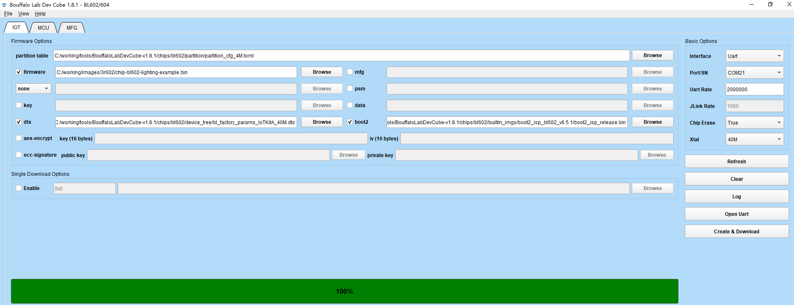

Table of Contents
=================

* [What is Matter?](#what-is-matter)
* [Third Reality Matter Projects](#third-reality-matter-projects)
* [Development Environment](#development-environment)
      * [Recommended OS](#recommended-os)
      * [Install Dependencies](#install-dependencies)
      * [Download Code](#download-code)
      * [Install Bouffalo Lab SDK](#install-bouffalo-lab-sdk)
      * [Set Environment Variables](#set-environment-variables)
      * [Compile BL602 ( main branch)](#compile-bl602--main-branch)
      * [Compile BL706 ( main branch)](#compile-bl706--main-branch)
      * [Compiled Results](#compiled-results)
* [Burn Firmware](#burn-firmware)
      * [Get Burning Tool](#get-burning-tool)
      * [Burn BL602](#burn-bl602)
      * [Burn BL706](#burn-bl706)
      * [Firmware for Download](#firmware-for-download)
      * [Hardware Scheme for Download](#hardware-scheme-for-download)
* [Control the Night Light](#control-the-night-light)
   * [Use iPhone and HomePod mini](#use-iphone-and-homepod-mini)
         * [Prepare](#prepare)
         * [Bind iPhone and HomePod](#bind-iphone-and-homepod)
         * [Add a Night Light in Home](#add-a-night-light-in-home)
         * [Reset Apple HomePod](#reset-apple-homepod)
         * [Remove Accessories from Home](#remove-accessories-from-home)
   * [Use Android Phone and Google Nest](#use-android-phone-and-google-nest)
         * [Prepare](#prepare-1)
         * [Set up Google Nest](#set-up-google-nest)
         * [Add a Night Light in Home](#add-a-night-light-in-home-1)
         * [Reset Google Nest](#reset-google-nest)
   * [Use Amazon Echo and Alexa](#use-amazon-echo-and-alexa)
   * [Factory Reset Night Light](#factory-reset-night-light)

# What is Matter?

Matter (formerly Project Connected Home over IP, or Project CHIP) is a new
Working Group within the Connectivity Standards Alliance (CSA, formerly Zigbee
Alliance). This Working Group plans to develop and promote the adoption of a
new, royalty-free connectivity standard to increase compatibility among smart
home products, with security as a fundamental design tenet.

The goal of the Matter project is to simplify development for manufacturers and
increase compatibility for consumers. The project is built around a shared
belief that smart home devices should be secure, reliable, and seamless to use.
By building upon Internet Protocol (IP), the project aims to enable
communication across smart home devices, mobile apps, and cloud services and to
define a specific set of IP-based networking technologies for device
certification.

# Third Reality Matter Projects

Third Reality  has actively participated in Matter. By the end of 2022, it has just 
developed two night light products, providing open source code and hardware for 
interested developers to download code, compile and burn firmware to the light 
for testing. Users can voice control lights (switch lights, adjust colors, and brightness) 
on HomePod mini, HomePod, Google Nest, Amazon Echo and other speakers that 
support Matter. Needless to say, users can also control these lights through their 
mobile phones.

These two lamps have PIR motion sensor and light sensor inside. With the help of 
these sensors, developers can directly develop practical night light lighting products. 
Third Reality  will open source all relevant code at an appropriate time to facilitate 
developers. 

Third Reality keeps updating the software and hardware of the existing Matter 
products, and provides users with more reference examples (in fact, it is a product with 
complete functions, and it will be easier for users to modify the code on this basis, 
and can achieve full customization functions).  At the same time, develops new products 
that support Matter standard.

Third Reality will pay attention to the progress of the Matter and upgrade with it 
synchronously, so that users can experience the latest version of Matter earlier. 
Matter is as vibrant as the Amazon rainforest. Let's go ahead.

# Development Environment

### Recommended OS

`Ubuntu` 22.04 LTS

### Install Dependencies

`sudo apt-get install git gcc g++ pkg-config libssl-dev libdbus-1-dev \`

​     `libglib2.0-dev libavahi-client-dev ninja-build python3-venv python3-dev \`

​    `python3-pip unzip libgirepository1.0-dev libcairo2-dev libreadline-dev`

### Download Code

`git clone https://github.com/thirdreality/nightlight_mt.git`

`cd nightlight_mt`

`git submodule update --init --recursive`

`source ./scripts/activate.sh`

If this script says the environment is out of date, it can be updated by running:
`source ./scripts/bootstrap.sh` 

### Install Bouffalo Lab SDK

`cd third_party/bouffalolab/repo`

`sudo bash scripts/setup.sh`

### Set Environment Variables

`export BOUFFALOLAB_SDK_ROOT=/opt/bouffalolab_sdk`

### Compile BL602 ( main branch)

`./scripts/build/build_examples.py --target bouffalolab-bl602-iot-matter-v1-light build`

### Compile BL706 ( main branch)

`./scripts/examples/gn_bouffalolab_example.sh lighting-app out/bouffalolab-bl706-night-light-light BL706-NIGHT-LIGHT module_type=BL706C-22 enable_cdc_module=true`

### Compiled Results

at ./out directory

# Burn Firmware

### Get Burning Tool

The burning tool "**Bouffalo Lab Dev Cube**" can be downloaded from the bouffalo official website 

https://dev.bouffalolab.com/download

or found under the tools directory of the project path.

### Burn BL602

1. press and hold the key on the Night Light’s pinhole
2. press the reset button on the debugging board
3. release the Night Light’s key to enter the burning mode
4. run BLDevCube.exe ( at burning tool directory ) on Windows OS
5. Set parameters as shown in the following screenshot (get partition table, dts and boot2 from the burning tool, firmware from the build)
6. click Create & Download button
7. wait until the progress bar is 100%, which means the burning is completed

### Burn BL706

1. prepare a USB cable with one female end and one male end
2. connect the Night Light with a female USB port
3. press and hold the key on the Night Light’s pinhole
4. connect the male USB port to the USB interface of the computer
5. then release the Night Light’s key to enter the burning mode
6. run BLDevCube.exe ( at burning tool directory ) on Windows OS 
7. Set parameters as shown in the following screenshot (get partition table and firmware from the build, dts from the burning tool)
8. click Create & Download button
9. wait until the progress bar is 100%, which means the burning is completed

                          

### Firmware for Download

From this path: `"./nightlight_mt/docs_3r/firmware"` (including the `bl602` and `bl706` subdirectories), you can download the compiled nightlight bin and the dependent firmware, and directly burn and test them without compiling them yourself.

### Hardware Scheme for Download

From this path: `"./nightlight_mt/docs_3r/hardware"`, you can download the hardware implementation schematic, refer to the scheme, and conduct in-depth research against the code.

# Control the Night Light

## Use iPhone and HomePod mini

#### Prepare

Upgrade the iPhone OS to 16.1.2 or higher

Confirm that the App Home is installed on your phone

Upgrade HomePod to version 16.1 or above

#### Bind iPhone and HomePod

1. Plug the HomePod mini or HomePod into the power supply. Wait for the prompt to sound and the indicator on the HomePod mini or the top of the HomePod starts flashing white.
2. Unlock your iPhone or iPad and place it close to the HomePod mini or HomePod. When "Settings" appears on the device screen, tap this button.
3. When the system prompts you to place the HomePod mini or HomePod in the center of the iPhone or iPad viewfinder, follow the prompts to complete pairing. If you can't use the camera, please click "Enter password manually", and Siri will respond with a four digit password. Please enter this password into your device.
4. Follow the onscreen instructions to select your settings. After setting up, you can also customize and manage all the HomePod mini or HomePod settings in the Home app.
5. Wait for HomePod mini or HomePod to finish setting, then tap Finish.

#### Add a Night Light in Home

1. BL602 or BL706 light is connected to the computer

2. UART baud rate is set to 2000000, and power on again

3. From the uart log, copy URL similar to the following:

    `https://project-chip.github.io/connectedhomeip/qrcode.html?data=MT%3A6FCJ142C00KA0648G00`

    <u>*Note: For BL706 Night Light you can print the URL multiple times by short pressing the key*</u>

4. Open the URL above with a browser, and normally, there will be a QR code on the screen

5. Open the mobile phone Home App, click the "+" in the upper right corner, and select "Add accessories" from the pop-up menu

6. Scan the QR code of the night light on the pop-up interface, and add it according to the prompts. You can customize the location and name of the accessories at Home

7. Wait for the configuration to be completed, and there will be a new night light in Home

8. You can open the accessories interface to control the night light through touch, or control the light through voice interaction, such as "turn on all lights"

#### Reset Apple HomePod

Power on the loudspeaker after power off for 10s

Wait for 5s after power on, press the middle position of the speaker with your index finger

Release after you hear 3 beeps, according to the speaker prompts, and there will be a chime

#### Remove Accessories from Home

Open the Home App and enter "My Home"

Tap the accessory to be deleted to open the accessory details page

Slide the screen to the bottom, select "Remove accessories", and confirm

For HomePod, select "Restore HomePod..." and then "Remove Accessories"

## Use Android Phone and Google Nest

#### Prepare

A  Google Nest (speaker or display)

Latest version of the Google Home app

A Google Account

A mobile phone or tablet that:

*Has Android 8.0 or later*

*Works with 2.4 GHz and 5 GHz Wi-Fi network (a WPA-2 Enterprise network won't work)*

*Has Bluetooth turned on*

*An Internet connection and secure wireless network*

#### Set up Google Nest

Open the Google Home app (upgrade to the latest version first) on your mobile phone

Recommended to set Google Nest as the first device

Tap to select Devices enter the settings screen

Tap the + Add icon, Set up a device (set up a new device or add an existing device or service to your home)

Choose a home (you will be able to control the devices and services in this home) , then tap Next, Enter Looking for devices...

or Choose  Add another home, then tap Next,  enter a Home nickname and address

Wait a moment till you see " Nest Hub found" result text, then Scan the QR code on the Google Nest screen

Tab Connect when "Connect to device"  box pops up

Complete the setting of Google Nest

#### Add a Night Light in Home

Add a night light in Google Home, just like adding a night light in Apple Home above.

#### Reset Google Nest

If the device has been used before, you can factory reset it as follows:

Press and hold V+V - key simultaneously for 10 seconds

## Use Amazon Echo and Alexa

Matter-enabled Amazon Echo devices have built-in software to connect and control Matter smart home devices seamlessly. After a customer sets up an Echo, they can connect their devices by saying, "Alexa, discover my devices", or if you like, by adding the device in the Alexa app as follows: 

1. Install Amazon Alexa app on Android mobile phone

2. Set up your Echo speaker according to instructions

3. Open the Alexa app and enter "Device Settings" screen

4. Tap the + sign in the upper right corner to select "Add Device" from the pop-up screen

5. Enter the next screen SETUP and select "Connect your Matter Device"

   "Control your Matter device with Alexa", Next

   "Does your device have a Matter logo ?", Yes

6. "Locate a QR code shown for your device", tap "Scan Qr Code" at the bottom of the screen

7. "Allow Permission:  Bluetooth, Camera", Next 

8. "Allow Amazon Alexa to take pictures and record video ?"

   select "While using the app", then Scan the QR code for Matter Device

   Enter "Looking for your device" screen, wait a moment

   when you see "Connect device to Wi-Fi" select the hotspot your phone is using

9. "Device found and connected", tap "Done"

10. Enter the LIGHTS screen, you can control the lights added above, or voice control lights

    (Currently, it is recommended to use alexa control BL602)

## Factory Reset Night Light

Long press the key for about 7s, then release the key

During the process, the light first turns on and then off

Until the yellow light comes on, indicating that factory reset OK
